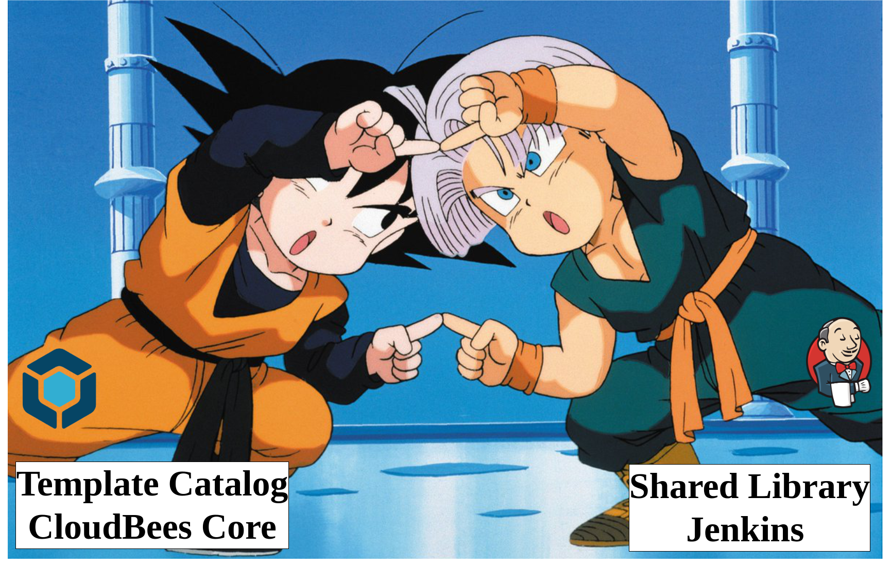

# Pipeline Home Demo

This repo is linked to the post `Template Catalog: Welcome to the Pipeline as Code family` from the [CloudBees Blog](https://www.cloudbees.com/blog).

Not only the [Template Catalog](https://docs.cloudbees.com/docs/admin-resources/latest/pipeline-templates-user-guide/setting-up-a-pipeline-template-catalog) and [Shared Libraries](https://jenkins.io/doc/book/pipeline/shared-libraries/) are complementary to each other but also compatible in their code structures. That’s why they can be integrated into a single point of control which it was named in the post as the "The Pipeline Home".

## Demo: Maven Docker App run by Kubernetes Cloud Agents

This demo presents a template that model the pipeline Continous Integration process in the Acme Corporation.  The pipeline defines Maven Apps of the corporation than are deployed as Docker containers. It integrates CloudBees Core and GitHub Enterprise via webhooks. Builds are managed by Kubernetes agents. Finally, Successful builds create an image with the project artifacts and it gets uploaded to Dockerhub (Docker-in-Docker).